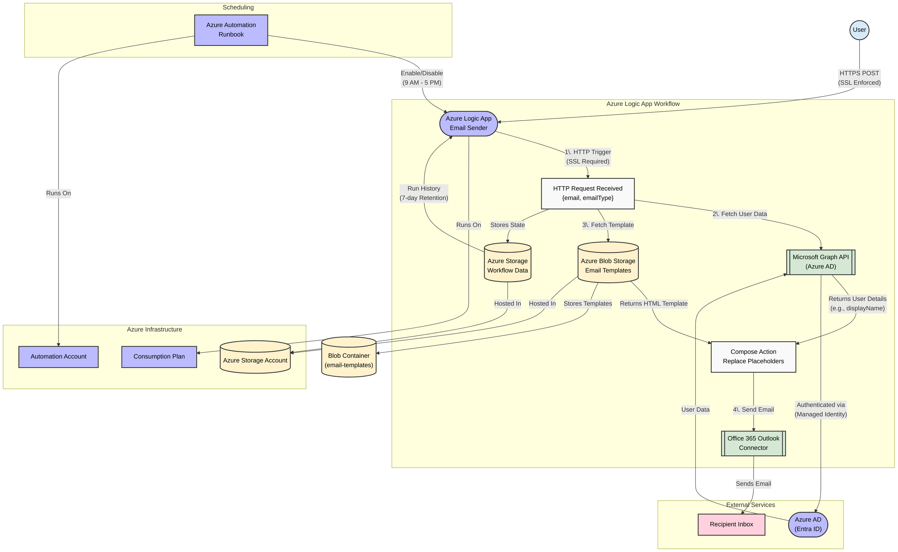

```mermaid
%%{init: { "theme": "default", "flowchart": { "htmlLabels": true, "nodeSpacing": 60, "rankSpacing": 60, "useMaxWidth": false }}}%%
flowchart TB
    A(("User"))
    B(["Azure Logic App<br/>Email Sender"])
    C["HTTP Request Received<br/>{email, emailType}"]
    D[["Microsoft Graph API<br/>(Azure AD)"]]
    E[("Azure Blob Storage<br/>Email Templates")]
    F["Compose Action<br/>Replace Placeholders"]
    G[["Office 365 Outlook<br/>Connector"]]
    M[("Azure Storage<br/>Workflow Data")]
    N["Azure Automation<br/>Runbook"]
    H(["Azure AD<br/>(Entra ID)"])
    I["Recipient Inbox"]
    J[("Blob Container<br/>(email-templates)")]
    K["Consumption Plan"]
    L[("Azure Storage Account")]
    O["Automation Account"]

    subgraph "Azure Logic App Workflow"
    direction TB
        B
        C
        D
        E
        F
        G
        M
    end

    subgraph "Scheduling"
    direction TB
        N
    end

    subgraph "External Services"
    direction TB
        H
        I
    end

    subgraph "Azure Infrastructure"
    direction TB
        K
        L
        O
    end

    A -->|"HTTPS POST<br/>(SSL Enforced)"| B
    B -->|"1\. HTTP Trigger<br/>(SSL Required)"| C
    C -->|"2\. Fetch User Data"| D
    C -->|"3\. Fetch Template"| E
    D -->|"Returns User Details<br/>(e.g., displayName)"| F
    E -->|"Returns HTML Template"| F
    F -->|"4\. Send Email"| G
    C -->|"Stores State"| M
    N -->|"Enable/Disable<br/>(9 AM - 5 PM)"| B
    D -->|"Authenticated via<br/>(Managed Identity)"| H
    G -->|"Sends Email"| I
    E -->|"Stores Templates"| J
    M -->|"Run History<br/>(7-day Retention)"| B
    H -->|"User Data"| D
    B -->|"Runs On"| K
    E -->|"Hosted In"| L
    M -->|"Hosted In"| L
    N -->|"Runs On"| O

    classDef user fill:#D6EAF8,stroke:#333,stroke-width:2px,color:#000
    classDef azureService fill:#BBF,stroke:#333,stroke-width:2px,color:#000
    classDef azureStorage fill:#FFF2CC,stroke:#333,stroke-width:2px,color:#000
    classDef externalService fill:#FFD1DC,stroke:#333,stroke-width:2px,color:#000
    classDef rectangle fill:#F9F9F9,stroke:#333,stroke-width:2px,color:#000
    classDef subroutine fill:#D5E8D4,stroke:#333,stroke-width:2px,color:#000

    class A user
    class B,H,N,K,O azureService
    class D,G subroutine
    class E,M,J,L azureStorage
    class I externalService
    class C,F rectangle
```
